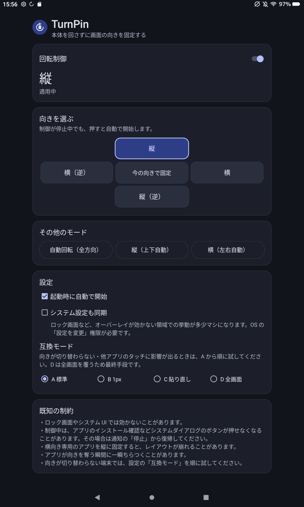

# TurnPin 🔄

**Android タブレットの画面の向きを、本体を回さずにアプリ内の操作だけで切り替え・固定する小さな補助アプリ** — Amazon Fire Max 11 (Fire OS 8) 向け

<!--
  スクリーンショットを撮ったら .readme/ に置いて、次の行のコメントを外してください。
  <p align="center">
    
  </p>
-->

タブレットで「画面の自動回転オフ」にしていても、`android:screenOrientation` を宣言しているアプリを起動すると向きが強制的に変わってしまいます。そして一度そうなると、**本体を物理的に回さない限り向きを戻せません**。寝転がって使うときやスタンドに固定しているときには、これが致命的に不便です。さらに OS 標準機能では「上下逆さまの縦」に切り替えることがそもそもできません。

TurnPin は、**アプリより上位に置かれる不可視のオーバーレイウィンドウに向きを宣言させる**ことで、他アプリの固定向き宣言を上書きします。これにより、縦・縦（逆）・横・横（逆）の 4 方向すべてを、画面上のボタンまたは通知から切り替えられます。Google Play Services 不要・サイドロードで動作します。

---

> ## ⚠️ 免責事項 — 必ずお読みください
>
> 本アプリは **MIT ライセンス**のもと **現状有姿（AS IS）** で提供される個人制作物です。
>
> - **利用はすべて完全な自己責任**です。
> - **作者および本リポジトリの提供者は、本アプリの使用・誤用・不具合によって生じたいかなる損害についても一切の責任を負いません。** これには、端末の不具合、データの損失、その他直接・間接を問わずあらゆる損害が含まれます。
> - 本アプリは**画面上に常時オーバーレイを重ねる性質上、他アプリやシステム UI の操作に影響を与える可能性**があります。特に「[既知の制約](#-既知の制約)」の 2 番目は必ずお読みください。
> - 動作の保証は一切ありません。ご自身の判断と責任においてご利用ください。
>
> **上記に同意できない場合は、ダウンロード・インストール・使用をしないでください。**

---

## 📥 ダウンロード

ビルド済みの APK は **[Releases](../../releases)** から入手できます（GitHub アカウントなしでダウンロード可）。

- **latest**: `main` の最新ビルド（`TurnPin.apk`）
- **v タグ**: バージョン付きビルド（`TurnPin-vX.Y.Z.apk`）

> APK は **release 署名**です（Google Play の正規署名ではない、作者の個人署名です）。サイドロード用途で問題なくインストールできます。

## 📲 インストール（サイドロード）

1. `TurnPin.apk` を Fire タブレットに転送（クラウド / USB メモリ / ダウンロード等）。
2. Fire 側で **設定 → セキュリティとプライバシー → 不明ソースからのアプリ** を許可。
3. ファイルマネージャで APK をタップしてインストール。

## 🕹 使い方

### 1. オーバーレイ権限を許可する

初回起動時に **「オーバーレイ権限が必要です」** カードが出ます。**「権限を許可」** を押して、OS の設定画面で「他のアプリの上に表示」を有効にしてください。**この権限が無いと TurnPin は動作しません。**

### 2. 向きを選ぶ

**「向きを選ぶ」** カードの十字グリッドから向きを選びます。

```
        [ 縦 ]
  [横(逆)] [今の向きで固定] [ 横 ]
        [縦(逆)]
```

- 制御が停止中でもボタンは押せます。押すと**自動的に制御が開始**されます。
- 「その他のモード」から「自動回転（全方向）」「縦（上下自動）」「横（左右自動）」も選べます。
- 上部の **「回転制御」スイッチ**で ON / OFF を切り替えられます。OFF にするとオーバーレイが完全に取り外され、OS 標準の挙動に戻ります。

### 3. 通知から操作する

制御中は常駐通知が出ます。**アプリを開かずに**ここから切り替えられます。

```
[アプリ] [縦] [横] [縦逆] [横逆] [自動] [停止]
```

> ⚠️ **「停止」ボタンの場所を覚えておいてください。** 後述の制約 2 に当たったとき、ここが唯一の復帰手段になります。

### 4. 設定

| 項目 | 説明 |
|---|---|
| 起動時に自動で開始 | 端末の再起動後、前回のモードで自動的に復帰します |
| システム設定も同期 | OS 側の回転設定も合わせて書き換えます。ロック画面などオーバーレイが効かない領域での挙動が多少マシになります（「設定の変更」権限が必要／既定 OFF） |
| 互換モード | オーバーレイの貼り方を A〜D から選びます。向きが切り替わらない端末で順に試してください |

---

## ⚠️ 既知の制約

1. **ロック画面・システム UI には効かない可能性があります。** オーバーレイを表示できない領域では OS の設定が優先されます。

2. **⚠️ 制御中、一部のシステムダイアログのボタンが押せなくなることがあります。** Android には「画面上に別アプリが重なっている」状態で、APK インストール確認や権限付与ダイアログのボタンを無効化する仕組みがあります。同種のアプリで実際に報告されている既知の挙動です。
   **▶ 復帰方法: 通知バーを開き、TurnPin の通知の「停止」を押してください。** オーバーレイが外れてダイアログを操作できるようになります。

3. **アプリが向きを奪う瞬間にちらつくことがあります。** オーバーレイによる再適用は事後的なので、一瞬だけ相手アプリの向きになる場合があります。

4. **本来横向き専用のアプリを縦に固定すると、レイアウトが崩れる／画面外にはみ出すことがあります。** これはアプリ側の実装によるもので TurnPin では補正できません。

5. **`updateViewLayout` で向きが反映されない ROM があります。** その場合は設定の互換モードを **C（貼り直し）** に切り替えてください。

6. **⚠️ Fire Max 11 では「横」と「横（逆）」が同じ向きになります。** TurnPin は `SCREEN_ORIENTATION_REVERSE_LANDSCAPE` を正しく宣言していますが（`dumpsys window` で確認済み）、Fire OS 8 側がこれを「横」と同じ回転（`ROTATION_270`）に解決してしまうため、横方向の 180° 反転ができません。**互換モード A / C / D のいずれでも同じ**でした。端末単体では `user_rotation=1` にすれば逆向きの横を表示できるので、ハードウェアの制約ではなく Fire OS の向き解決の挙動です。
   縦方向（「縦」↔「縦（逆）」）の 180° 反転は正常に動作します。

7. **targetSdk を 31 以上に上げてはいけません。** Android 12 でオーバーレイのタッチ透過に制限が入り、Android 16/17 系では大画面での固定向き宣言が無視される変更が入っています。中核機能が壊れます。

8. **Fire OS はバックグラウンドプロセスを積極的に停止します。** 前面サービス＋常駐通知が必須の構成です。**通知を消さないでください。**

9. **APK は作者の個人署名（release 署名）です。** Google Play 等の正規ストア経由の配布ではありません。

---

## ✅ 実機での動作確認チェックリスト

**Fire Max 11（KFSNWI / sunstone、Fire OS 8.3.3.8 / Android 11 / API 30）で検証済み。**

| | 項目 | 結果 |
|---|---|---|
| AC1 | 横向き固定のアプリを起動した状態で TurnPin を「縦」にすると、画面が縦になる | ✅ |
| AC2 | 縦・縦逆・横・横逆の 4 方向すべてに切り替わる（本体を回さずに） | ⚠️ 3/4（下記参照） |
| AC3 | ホーム画面・設定アプリでも指定した向きが維持される | ✅ |
| AC4 | 端末を物理的に回しても、固定した向きが維持される | ⏳ 未確認 |
| AC5 | 「停止」で OS 標準の自動回転挙動に完全に戻る（オーバーレイが残らない） | ✅ |
| AC6 | 通知の各ボタンから、アプリを開かずに向きを切り替えられる | ✅ |
| AC7 | 端末再起動後、「起動時に自動で開始」が ON なら前回のモードで自動復帰する | ⏳ 未確認 |
| AC8 | オーバーレイ権限が無い状態でアプリを開いてもクラッシュせず権限カードが出る | ✅ |
| AC9 | アプリを「強制停止」してもオーバーレイが残留しない | ✅ |
| AC10 | 制御中に他アプリのボタンがタップできなくなる事象が起きない | ✅ |

**AC1 の確認方法**: TurnPin を停止した状態では横（rotation 3）を強制する動画プレイヤー Activity を、TurnPin を「縦」にしてから起動。画面は縦（rotation 0）のままで、`dumpsys window` の `mLastOrientationSource` が TurnPin のオーバーレイウィンドウになることを確認しました。

**AC10 の確認方法**: オーバーレイ適用中に設定アプリをタップ操作し、画面遷移が起きること（＝タッチがオーバーレイを透過していること）を確認。全画面を覆う互換モード D でも透過しました。ただし §11-2 のシステムダイアログの件は OS 側の仕様であり、この確認には含まれません。

**AC4・AC7 が未確認の理由**: AC4 は端末を物理的に回す必要があり、AC7 は再起動でワイヤレスデバッグ接続が切れるため、いずれもリモート検証では実施できていません。

中核ロジック（向きモードのマッピング、適用・停止・復帰の状態遷移、システム回転値の算出）は JVM 単体テストで検証済みです。

```bash
./gradlew test   # 63 tests
```

---

## 🛠 ソースからビルドする（開発者向け）

CI（GitHub Actions）が自動ビルドしますが、手元でビルドしたい場合は以下。

- **クイック（SDK 導入済みの場合）**
  ```bash
  echo "sdk.dir=$HOME/android-sdk" > local.properties
  ./gradlew assembleDebug
  # 生成物: app/build/outputs/apk/debug/app-debug.apk
  ```
  Gradle Wrapper（`gradlew` / `gradle-wrapper.jar`）は同梱済みで、初回に Gradle 9.3.1 を自動取得します。

- **WSL2 でゼロから環境構築する手順** … [BUILD.md](BUILD.md)

### 技術仕様

| 項目 | 値 |
|---|---|
| 言語 | Kotlin（AGP 9 のビルトイン Kotlin。`org.jetbrains.kotlin.android` 不要） |
| AGP / Gradle | 9.1.1 / 9.3.1 |
| JDK | 17 |
| build-tools / compileSdk | 36.0.0 / 36 |
| minSdk / targetSdk | 28 / 30（targetSdk 30 は据え置き必須。制約 7 を参照） |
| 対応機種 | Fire OS 7・8（Android 9 / 11）の Fire タブレット。**Fire Max 11 で動作確認済み** |
| 外部依存 | なし（framework View のみ。AndroidX / Material / Compose 不使用） |
| テスト依存 | JUnit4 のみ |
| namespace / applicationId | `com.turnpin` |

### 実現方式

Android の WindowManagerService は、**Z オーダー上位のウィンドウが宣言した `screenOrientation` を優先**して画面の向きを決定します。`TYPE_APPLICATION_OVERLAY` はアプリのウィンドウより上位に配置されるため、そこに向きを宣言させることでアプリ側の固定向き宣言を上書きできます。

```kotlin
WindowManager.LayoutParams(
    0, 0,                                              // 幅・高さ 0（描画しない）
    WindowManager.LayoutParams.TYPE_APPLICATION_OVERLAY,
    FLAG_NOT_FOCUSABLE or FLAG_NOT_TOUCHABLE or FLAG_LAYOUT_IN_SCREEN,
    PixelFormat.TRANSLUCENT,
).apply { screenOrientation = ActivityInfo.SCREEN_ORIENTATION_LANDSCAPE }
```

`Settings.System.USER_ROTATION`（WRITE_SETTINGS）を書き換える方式は、OS の自動回転設定を変えるだけで `screenOrientation` を宣言したアプリにはまったく効かないため、**補助機能としてのみ**（既定 OFF）実装しています。

### 設計

Android フレームワークに触れる部分をすべて interface 越しにし、中核ロジックを JVM 単体テストで検証できるようにしています。

```
app/src/main/java/com/turnpin/
├── MainActivity.kt                    # UI。Service へ Intent コマンドを送るだけ
├── model/                             # Android 非依存
│   ├── OrientationMode.kt             # 8 モード + ActivityInfo マッピング + next()
│   ├── OrientationAxis.kt
│   └── OverlayStrategy.kt             # 互換モード A〜D
├── core/                              # ★Android 非依存。JVM テスト対象
│   ├── OrientationController.kt       # 適用・停止・復帰の状態遷移
│   ├── ApplyResult.kt                 # Success / PermissionDenied / Failed
│   ├── SystemRotation.kt              # USER_ROTATION の算出
│   ├── OverlayHandle.kt
│   ├── SettingsStore.kt
│   └── PermissionChecker.kt
├── platform/                          # Android 実装
│   ├── WindowManagerOverlayHandle.kt
│   ├── PrefsSettingsStore.kt
│   ├── AndroidPermissionChecker.kt
│   └── SystemRotationSync.kt
└── service/
    ├── TurnPinService.kt              # オーバーレイの唯一の所有者（前面サービス）
    ├── NotificationFactory.kt         # RemoteViews 通知
    └── BootReceiver.kt
```

オーバーレイの実体は `TurnPinService` が**プロセス内でただ 1 つだけ**持ちます。Activity 側にも持たせると多重 `addView` になり、アプリを閉じた瞬間にオーバーレイが外れてしまうためです。

---

## 📄 ライセンス

[MIT License](LICENSE) © 2026 shimasan0x00
